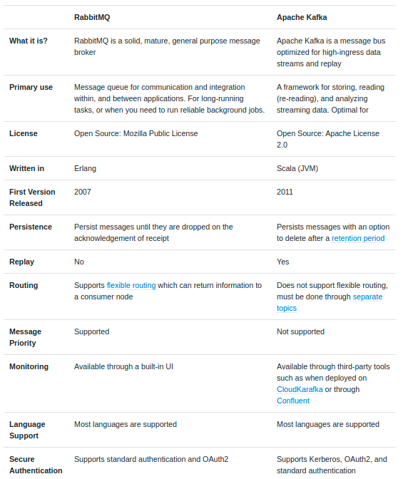

# RabbitMQ 
`Asynchronous messaging system` with Java and Spring


### Index
``` - What Messaging means in software and why we need?
- Messaging Protocols
- A closer look at AMQP
- Meeting with RabbitMQ
- Fundamentals concepts of RabbitMQ & Messaging - Queues, Topics and Exchanges
- Comparison of Messaging queuing frameworks
- Getting started with rabbitmq implementation
- How to use RabbitTemplate for sending simple and complex messages
- Configure Queues, Exchanges, Bindings from code
- `Excercise` Realize an asynchronous scenario with two different applications
``` 

### Installations
* Download - https://www.rabbitmq.com/download.html


### Section 1 to 6: 

## What Messaging means in software and why we need?
Messaging - Basically form of communication with each other like person to person, application to applications etc.
In the software world, provides a mechanism of `loosely-coupled` integration of software or application components, systems and even multiple systems together.

``` If you ever used SOAP protocol then you are familiar with the message, header and body concepts with a different form. SOAP messages exchange and shared through the envelope of share messages to another system or application.
Softwares system receiving these envelopes/message will take certain action based on the content of the message. This is how the soap protocol is working and use till date.
```

The message is an essential element for any kind of software. As components interact with each other with multiple ways and forms
* Method calls
* RPC
* HTTP clients and server
* And many other

Mainly message has to be loosely coupled. 

``` Let's look at an example
E-commerce sites on BLACK Friday with millions of customers orders
Telecom operator with million of customer messages
To carry out the above task, there is a high risk of the system may collapse because of the load!

Instead of carrying out the operation at once, we need to queue the request and process it one by one.
So to overcome the above problem `advance messaging protocols` comes to the RESCUE!
```
Note: Advanced structures for the messages to flow through are queues, topics, channels exchanges and other depending on the protocol definition. 


## Messaging Protocols

Protocols are designed with keeping messaging in mind. Three most widely used protocols are:
- STOMP
- MQTT
- AMQP

### Simple text-oriented Messaging Protocol (STOMP)
* Provides an interoperable format so that STOMP clients can communicate with any STOMP message broker to provide easy and widespread messaging interoperability among many languages, platforms and brokers.
* Its similar to HTTP like design
* `Sender does not deal` with concepts like queues and topics; uses a SEND semantic with a "destination" string for where the message to deliver.
* However the `receiver can implement` queues, topics and exchanges 
* Consumers of messages SUBSCRIBE to these destinations

### Messages queue telemetry transport (MQTT)
* Design of this protocol is to have Machine to Machine(M2M)/Internet of things connectivity protocol.
* Highly Standardized
* Simply pub-sub messaging
* Specially designed for resource-constrained devices and low bandwidth high latency networks such as satellite links
* Very lightweight - ideal for mobile and IoT
* AWS IoT and Greengrass edge-computing solutions are designed around MQTT

### Advanced messaging queuing protocol (AMQP)
* Reliable and interoperable as it can be used anywhere and in any system
* Highly Standardized
* Provides a wide range of features related to messaging including reliable queuing, topic-based pub-subs messaging, flexible, transactions and security.
* JP Morgan process billions of messages a day with AMQP!


 ## A closer look at AMQP
 
 AMQP solutions from different vendors `does` work which is where other protocols failed
 Highly standarized
 
 Lets look up an example:
 
``` We want completel;y differen application to examples messages
Vendor A - Java Application  
Vendor B - Dot net application
Vendor C - AMQP 1.0 broker
 
 
 `Vendor A ----------  (Broker)   --------------  Vendor B`
 
 Vendor A publish message from java aaplication to AMQP broker 
 Vendor B receives messages from AMQP broker which is in the middle
 ```
 
 Doest not rely on single application. You just have to focus on the message which you want to deliver.
 here are some features :
 * AMQP make difficult become practical
 * Diverse programming laguanges can communicate easily
 * Enable messaging as a `cloud service`
 * Advance pubs and subs

Use cases:
- Want a real time feed of constantly updating information? `no problem`
- Want an encrypted assured transaction? `no problem`
- Want your message to be delivered when the destination comes online? `no problem`
- Want things to work on popular OS and laguages? `no problem`


## Meet RabbitMQ! 

Powerful open source message broker and most popluar implementation of `AMQP`!
Provides a robust and flexible messaging platform designed to interoperate with other 
messaging systems
Developed using Erlang programming language
It support clustering for fault tolerance and scalability- common use when dealing with messages 
Protocol defines exchanges, queues and bindings 
Allows multiple connections channels inside a single TCP connection in order to remove the overhead
of opening a large number of TCP connections to the message broker. (not to think of overhead)

## Design Overview:

`publisher -> (mutiple own or default) exchange ---(binding) -> queue -> subscriber`

Explanation 
Publisher will send message to exchange
Subsriber will listen to queue for broker/rabbitmq
Queue wil get the messages from binding
and exchanges are binding to queue via binding


## Queues, Topics, Exchanges and Bindings


# Exchange

Actual AMQP elements where messages are sent at first
Take a message and routes it into one or more queues
Routing algorithm decides where to send messages from exchange
Bindings are simply used to bind exchanges to queues for message delivery

```Types of exchange:
Direct Exchange - (Empty String) amd amq.direct - This one is default one
Fanout Exchange - ampq.fanout - distribute message to all queues
Topic Exchange - ampq.topic - delivers to the tied queue with specific topic
Headers Exchange - ampq.match - this is used when you want to exchange 
                   headers with third party app 
```
                   
# Queues

Foundation or core element in any MQ protocol especially for RabbitMQ
Messages are required to queues from exchanges
Queues are the final destinations in RabbitMQ before being received by subscribers
Routing algorithms depends on the exchange type and rules called `Bindings`
`Bindings` are simply used to `bind` `exchanges to queues` for `message delivery`

```Properties of Queue:
Name: The name of the queue
Durable: Either presist the queue to the disk or not - back up in case of failure
Exclusive: Delete the queue if not used anymore
Auto-Delete: Delete the queue when customer unsubscribes 
```                
               
# Topics

Topics are simply the "subject" part of the messages
Defined as routing_key for message grouping 
Special formatting for better use : "app.logs.error"
Optional parameters for message exchange 
You can send or receive message with any topic information
Topic exchanges are defined using topics for message delivery

# Bindings

Rules that exchanges use to route messages to queues
Many have an optional `routing key attribute` used by some exchanges types
So the routing key acts like a filter 
Binding Analogy:
 * Queues are like destination in delhi city
 * Exchanges are like Indra gandhi airport in delhi city
 * Bindings are th route from Indra gandhi airport to your destination. There can be 
   zero or many ways to reach it
If message cannot be routed to any queue(there are no bindings for the exchange it 
was published to) it is either dropped or returned to the publisher, depending on 
message attributes the publisher has set.


# RabbitMQ vs other: Comparison



Kafka vs RabbitMQ


 
 
 
 
 


